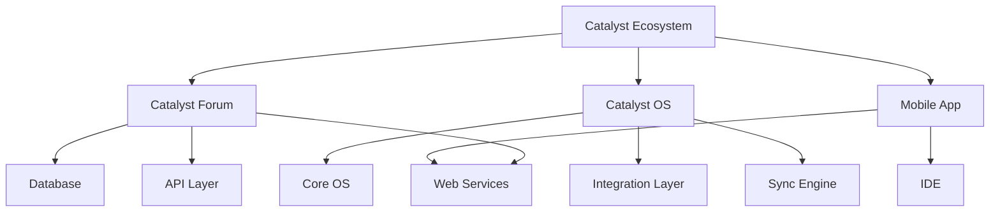

# Catalyst 
### Your Creation Curated by Us

  

## 📖 About Catalyst

Catalyst is a revolutionary educational ecosystem designed to transform computer science education through an integrated suite of products. Our mission is to create a dynamic, engaging, and inclusive environment where students can learn, collaborate, and grow together. By combining cutting-edge technology with educational best practices, Catalyst aims to bridge the gap between theoretical knowledge and practical application.

## 🛠️ Technical Architecture

## 🎯 Product Suite

### 1. Catalyst Forum (Web Application) 🌐
*Where ideas take flight* 🚀

Our flagship web platform serves as the central hub of the Catalyst ecosystem, fostering collaboration and growth.

#### Objectives
- **Project Showcase** - Your digital portfolio for all creations
- **Mentorship Arena** - Connect with seniors and industry experts
- **Resource Vault** - Curated learning materials and lab resources
- **Achievement Center** - Gamified learning with badges and rewards
- **Collaboration Hub** - Find teammates for your next big idea
- **Smart Analytics** - Track your learning journey

Our flagship product designed to make programming education more dynamic and inclusive.

### 2. Catalyst OS (Custom Operating System) 💻
*Your workspace, reimagined* 💻

A custom-tailored operating system that transforms regular computers into powerful learning machines.

#### Objectives
- **Seamless Integration** - Direct access to Catalyst Forum
- **Smart Sync** - Your work follows you everywhere
- **Dev Environment Plus** - Pre-configured tools and compilers
- **Offline First** - Work without interruptions
- **Auto-Archive** - Never lose your progress
- **Focus Mode** - Distraction-free learning environment

### 3. Catalyst Mobile 📱
A mobile application providing on-the-go access to the Catalyst ecosystem.

#### Key Features:
- Complete forum accessibility
- Project showcase viewing
- Discussion participation
- Resource access
- Progress tracking
- Push notifications
- Offline content access
- Quick feedback system
- Mobile-optimized interface
- Cross-device synchronization

## 🚀 Future Developments
- **Controlled Web Access**
  - Curated educational resources
  - Monitored browsing
  - Resource whitelisting
  - Usage analytics

- **Student-Developed Extensions**
  - Custom tool integration
  - Plugin system
  - Automation scripts
  - Utility modules

- **Academic Automation Tools**
  - Practical file generators
  - Assignment templates
  - Report builders
  - Documentation helpers

Mobile application for on-the-go access to the Catalyst ecosystem.

## ⚡ Why Catalyst?

### For Students 👨‍🎓
- **All-in-One Solution**: Everything you need, exactly where you need it
- **Growth Tracking**: Watch yourself evolve from novice to expert
- **Community Power**: Learn, share, and grow together
- **Future Ready**: Build a portfolio while you learn

### For Educators 👨‍🏫
- **Smart Monitoring**: Real-time student progress tracking
- **Resource Management**: Distribute and update learning materials efficiently
- **Performance Analytics**: Make data-driven teaching decisions
- **Engagement Metrics**: Understand and improve student interaction

### Future Products 🚀
We're continuously expanding our ecosystem with new products and tools:
- Custom development tools
- Automation utilities
- Educational plugins
- Collaboration tools
- Resource management systems

## 💡 Innovation Features

### Smart Integration
- Seamless product interconnectivity
- Unified user experience
- Cross-platform synchronization
- Consistent data management
- Integrated workflows

### Automation Tools
- Practical file creation
- Academic task management
- Resource organization
- Progress tracking
- Report generation

## 🛠 Technical Architecture

### Web Application
- **Frontend**
  - Modern web technologies
  - Responsive design
  - User-friendly interface
  - Interactive elements
  - Real-time updates

- **Backend**
  - Secure authentication
  - Data management
  - API integration
  - Performance optimization
  - Scalable architecture

### Custom OS
- **Core Features**
  - LAN integration
  - Offline capability
  - Development tools
  - Security features
  - Resource management

- **Extensions**
  - Controlled web access
  - Custom tool integration
  - Student-developed plugins
  - Academic utilities
  - Automation scripts

## 🤝 Community Engagement

### Contribution Guidelines
- Open to student contributions
- Tool and extension development
- Resource creation
- Documentation support
- Feature suggestions

### Quality Control
- Code review process
- Testing requirements
- Documentation standards
- Performance criteria
- Security guidelines

## 📞 Support

### Documentation
- User guides
- Technical documentation
- FAQs
- Tutorials
- Best practices

### Contact
- Development team
- Faculty advisors
- Support channels
- Community forums
- Feedback system

## 📝 License

MIT License

Copyright (c) [2024] Project Catalyst

Permission is hereby granted, free of charge, to any person obtaining a copy
of this software and associated documentation files (the "Software"), to deal
in the Software without restriction, including without limitation the rights
to use, copy, modify, merge, publish, distribute, sublicense, and/or sell
copies of the Software, and to permit persons to whom the Software is
furnished to do so, subject to the following conditions:

The above copyright notice and this permission notice shall be included in all
copies or substantial portions of the Software.

THE SOFTWARE IS PROVIDED "AS IS", WITHOUT WARRANTY OF ANY KIND, EXPRESS OR
IMPLIED, INCLUDING BUT NOT LIMITED TO THE WARRANTIES OF MERCHANTABILITY,
FITNESS FOR A PARTICULAR PURPOSE AND NONINFRINGEMENT. IN NO EVENT SHALL THE
AUTHORS OR COPYRIGHT HOLDERS BE LIABLE FOR ANY CLAIM, DAMAGES OR OTHER
LIABILITY, WHETHER IN AN ACTION OF CONTRACT, TORT OR OTHERWISE, ARISING FROM,
OUT OF OR IN CONNECTION WITH THE SOFTWARE OR THE USE OR OTHER DEALINGS IN THE
SOFTWARE.

---

**Catalyst Ecosystem** - Developed with ❤️ by the Computer Science Engineering Department

*Empowering the next generation of developers through innovative educational technology*

